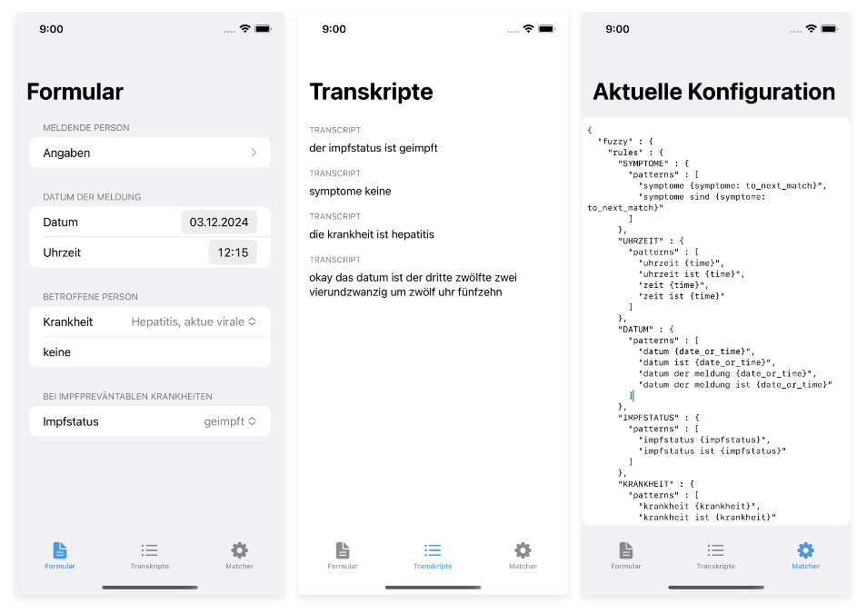

# Formfilling Demo App

This app is a showcase for KENBUN's KidouSDK on iOS.




## Features

The purpose of this app is to demonstrate how the KidouSDK transcription pipeline can be integrated into an iOS app to enable filling out forms by voice. Features include:

- [x] Connecting to an online Kidou Transcription Service via WebSocket
- [x] Reactively setting the remote matcher config based on the current UI context
- [x] Filling the form fields based on the matched entities. This includes dates, options, free text and more.

## Getting started

1. Clone the repository

    ```bash
    git clone git@github.com:kenbunitag/kidou-ios-form-filling-app.git
    cd kidou-ios-form-filling-app
    ```

2. Add the KidouSDK package
   - This app requires the `KidouSdkSwift-v0.0.9` library to be added as a Swift package. Reach out to KENBUN for access.


3. Add a license file
    
    - KidouSDK requires a license file to be added to the app's bundle. By default the code looks for `license.gpg`. Customize the path to your license file in `Config.swift`.


4. Run the app, start speaking and see the form fields being filled out.
 
   - "Das Datum ist der 12. Mai 2021 um 17 Uhr 12."
   - "Die Krankheit ist COVID 19."

